[回到知識庫總索引](https://released.github.io/)

<a id="article_top"></a>

# Nuvoton M2A23 – UART ISP code custom flow

> 說明 boot code 分布於 LDROM 與 APROM 尾端時的 UART ISP 架構，包含 Flash layout、雙 UART 分工、映像檔產生、checksum 與 ICP / ISP 工具操作。

## 內容摘要

- 先確認 LDROM、APROM application 與 APROM-end boot code 的實際位址範圍。
- 再沿著 boot decision、image transfer、erase、program、verify 與 reset 流程閱讀。
- 修改 scatter file 或 SRecord 設定後，務必以輸出檔、map file 與實際燒錄結果交叉驗證。

## Reference Project

This page references the following project:

- [M2A23BSP_ISP_UART_APROM](https://github.com/released/M2A23BSP_ISP_UART_APROM)


## Agenda

* System overview Flash layout + dual UART
* Boot code LDROM + APROM-end flow — **custom ISP flow**
* Application code flow
* Build & image generation
* Tool settings ICP / ISP
* Runtime notes & pitfalls

---

<a id="article_overview"></a>

## 1. System overview

### Flash allocation actual project


> **Important !!!** 
> **Address is configurable**  
> - `APROM Application` start / size  
> - `APROM Boot extension` base address example: `0x1E000`  
>
> These addresses are **project-dependent** and **NOT fixed by hardware** , **adjust them** according to:
> - actual project application code size requirement
> - actual project boot code feature size
>
> The values used in this project `0x1E000`, `0x1DFFC`are **one validated reference only**.


| Region | Address | Size | Purpose |
|------|--------|------|--------|
| APROM Application | `0x0000_0000 ~ 0x0001_DFFF` | `0x1E000` | app code |
| APROM checksum | `0x0001_DFFC` | 4 bytes |app code checksum address (CRC32) |
| Boot code ext in APROM | `0x0001_E000 ~ 0x0001_FFFF` | 8 KB | boot code extension |
| Boot code in LDROM | `0x0010_0000 ~ 0x0010_0FFF` | 4 KB | boot code |

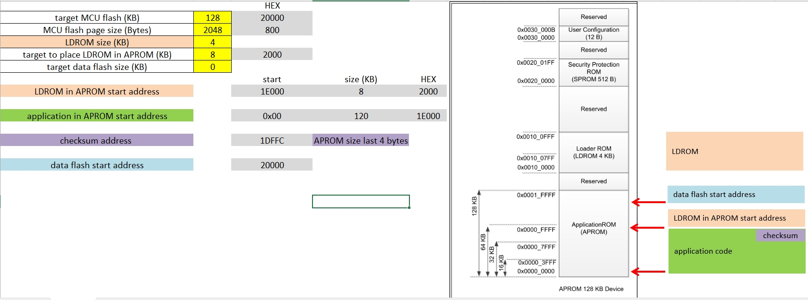

### UART assignment hard separation

| UART | Function | Used in |
|----|----|----|
| UART0 PB12/PB13 | ISP protocol | Boot only , to upgrade app code|
| UART1 PA8/PA9 | printf / progress log | Boot + App |

---

<a id="article_boot_flow"></a>

## 2. Boot code flow (LDROM + end of APROM)

### Source-level structure important

```
main.c
 └─ main
    ├─ SYS_Init
    ├─ ISP_Init
    ├─ ISP_check_app
    └─ while1
        └─ ISP_process

isp_config.c   ← ★ Custom ISP state & policy
isp_user.c     ← UART RX / CMD handler
```

### Boot code flow

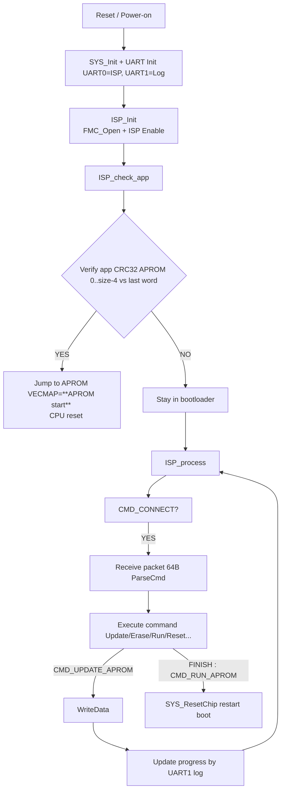

 1. Verify app CRC32 APROM (FAIL)
 2. Verify app CRC32 APROM (OK) 
 3. successful entry app code

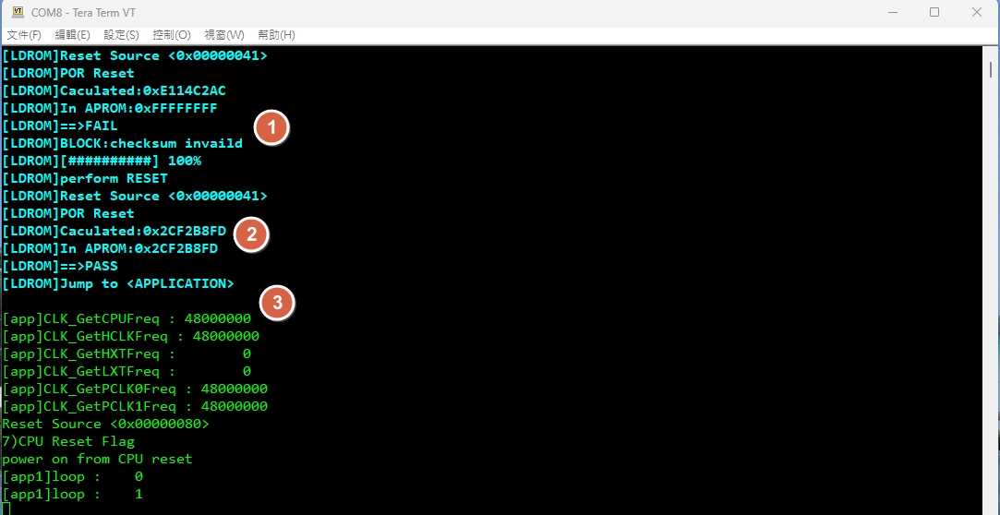


### Implementation points

* **Protocol parsing and policy are separated**
  * `isp_user.c` → packet handling
  * `isp_config.c` → CRC check / boot decision / ISP behavior
* UART logging is **post-action only**, never **execute printf** during RX parsing

---

<a id="article_app_flow"></a>

## 3. Application code flow

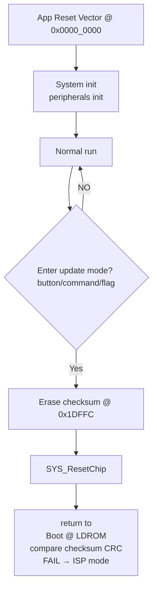

### Practical triggers from reference

* Press **'1'** by terminal → erase checksum (under app code)

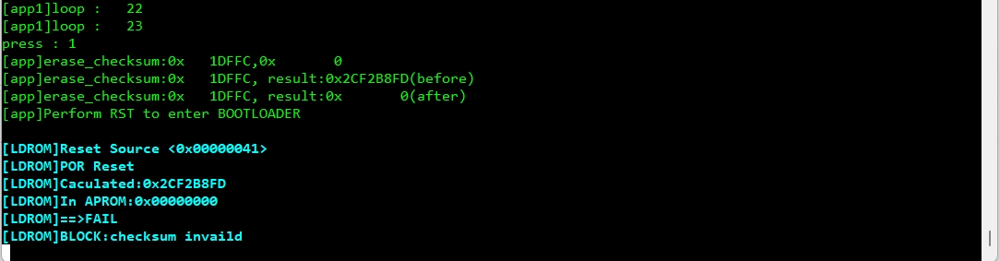


* Press **'Z' / 'z'** by terminal → reset to LDROM (under app code)

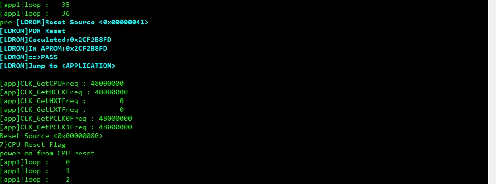


* Press **nRESET** PIN on EVM (boot from boot code to app code)

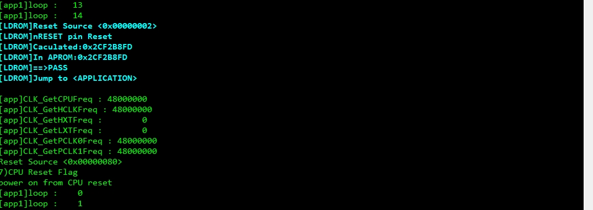

---

<a id="article_build"></a>


### Scatter file in Boot code

Boot code project **uses a single scatter file**: `uart_iap.sct`.

- **Modify the address/size macros** if project memory layout changes

The linker layout for:
- LDROM
- APROM boot extension

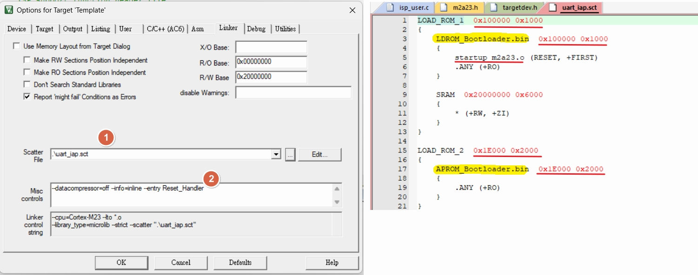


## 4. Build & image generation

### Keil targets recommended

| Target | Output |
|-----|------|
| LDROM_BOOT | `LDROM_Bootloader.bin` |
| APROM_BOOT_EXT | `APROM_Bootloader.bin` @ `0x1E000` |

### Scatter file for boot code (uart_iap.sct)

```c
LOAD_ROM_1  0x100000 0x1000
{
	LDROM_Bootloader.bin  0x100000 0x1000
	{
		startup_m2a23.o (RESET, +FIRST)
        .ANY (+RO)
	}
	
	SRAM  0x20000000 0x6000
	{
		* (+RW, +ZI)
	}
}

LOAD_ROM_2  0x1E000 0x2000
{
	APROM_Bootloader.bin  0x1E000 0x2000
	{
        .ANY (+RO)
	}
}
```

### Checksum strategy actual project

* CRC32 over: `0x0000_0000 ~ 0x0001_DFFB`
* Stored at: `0x0001_DFFC`
* Boot compares SW CRC32 vs stored value

---

<a id="article_tools"></a>

## 5. Tool settings

### ICP tool mandatory (programming boot code)

* Program:
  * `LDROM_Bootloader.bin` → LDROM
  * `APROM_Bootloader.bin` → APROM @ `0x1E000`

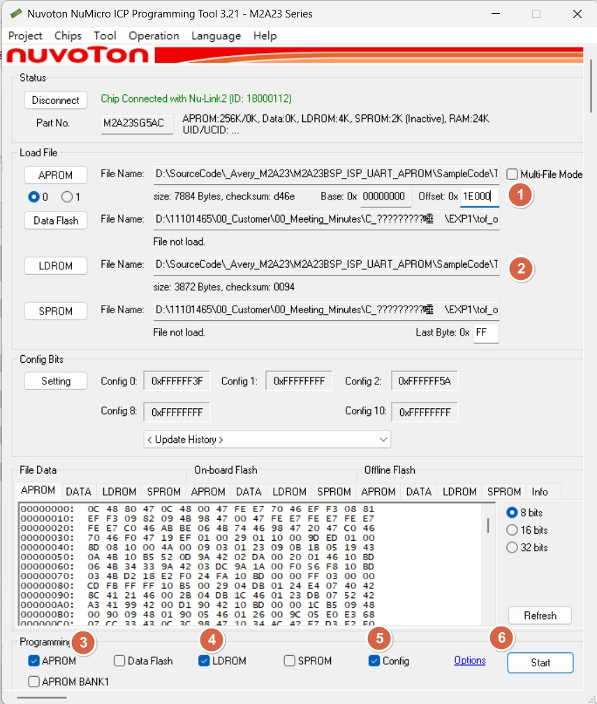

* CONFIG:
  * **Boot from LDROM WITH IAP**

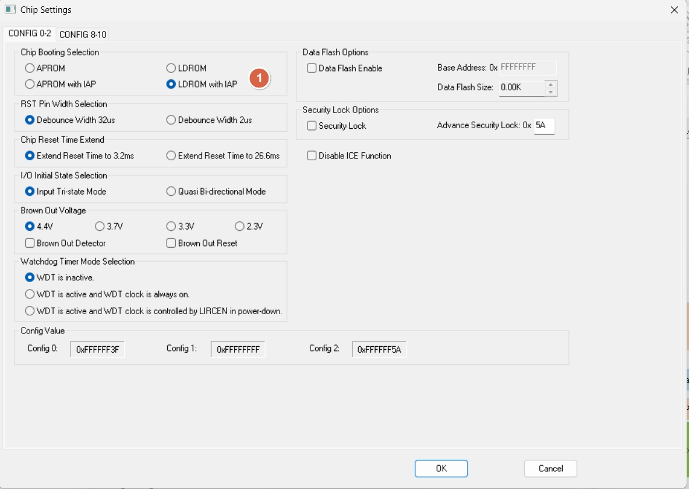

### ISP tool settings (programming app code)

* Connect ISP UART UART0 (target PCB) to PC USB-to-UART (UART bride)
* Open ISP tool (SW)

1. Select UART port & baud rate
2. Click “Connect” ( if MCU under boot mode , will stay with connected)
3. Load image:
   * APROM: load `APROM_application.bin`
4. Select `APROM`
5. Select `Reset and Run`
6. execute Program `Start`

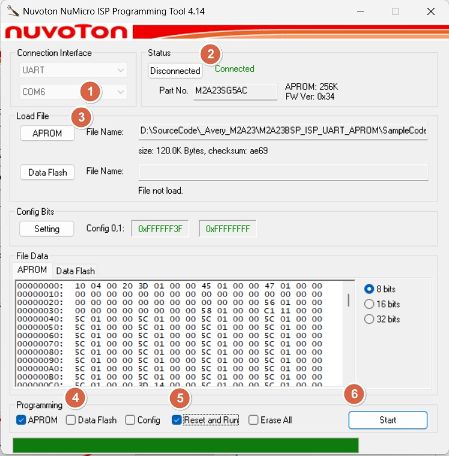

7. under ISP code tool , during upgrade application code

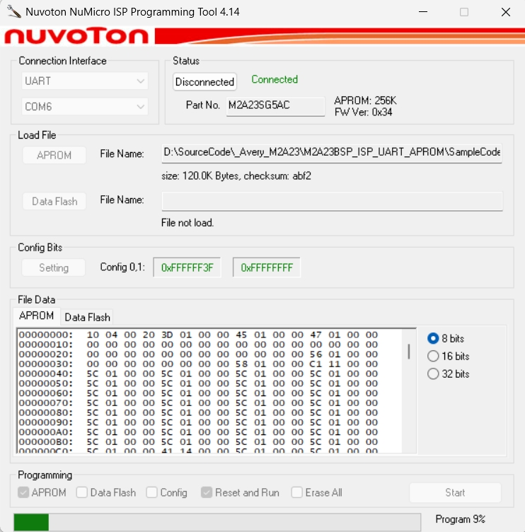

8. under boot code , during upgrade application code

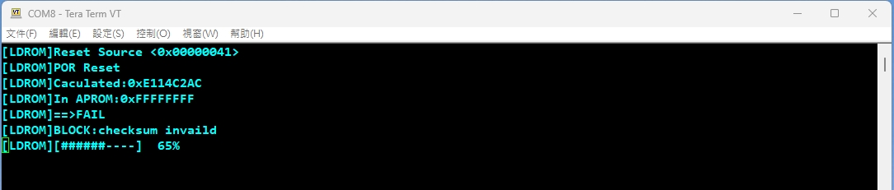


## Notes

* Bootloader may have a timeout window; connect sequence matters.
* After update, ensure CRC word is correct; otherwise boot will stay in ISP.


---

<a id="article_log"></a>

## 6. UART log & progress bar

```c

#define LDROM_DEBUG(format, args...) 		printf("\033[1;36m" "[LDROM]" format "\033[0m", ##args)

```

Progress bar width=10:

```
[LDROM] [#####-----] 50%
```

* Printed **after WriteData only**

---

<a id="article_summary"></a>

## 7. Summary

* Boot is **policy-driven** `isp_config.c`
* Application controls update entry by **checksum invalidation**

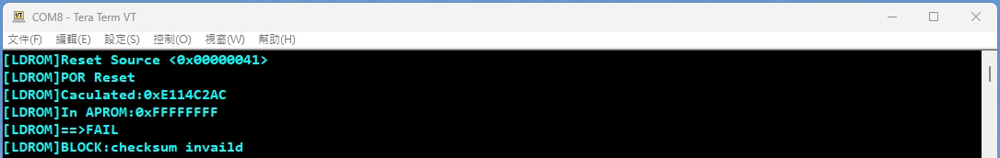

* Dual UART avoids ISP/log interference
* CRC32 is the single source of truth for boot decision

---

# Appendix: Extended Build / Tool Details

<a id="appendix_top"></a>

# Agenda

* Boot code in LDROM,APROM image generation
* SRecord post-build merge + CRC32

---

<a id="article_split_binary"></a>

# Boot code: split into 2 binaries LDROM + APROM end @ 0x1E000

## Why split?

* **LDROM size is limited** M2A23 LDROM is 4 KB, but a bootloader implementation often needs:
  * protocol + CRC32 + log + timeouts + safety checks

## layout default

* `APP`: `0x0000_0000` ~ `0x0001_DFFF`  0x1E000 bytes
* `LDROM ext in APROM`: `0x0001_E000` ~ `APROM_END`  boot extension, fixed address
* `LDROM`: device LDROM region 4 KB

## output artifacts

* `LDROM_Bootloader.bin` boot code stage-1
* `APROM_Bootloader.bin` boot code stage-2, linked at APROM@0x1E000

```c
refer to uart_iap.sct
```

* `APROM_application.bin` app code linked at 0x0000_0000, size ≤ 0x1E000, includes CRC word


[back to top](#article_top)

---

<a id="article_srecord"></a>

# SRecord settings merge + CRC32 append

## Use cases

* Fill holes with 0xFF
* KEIL setting : after compile , generate checksum with by batch file

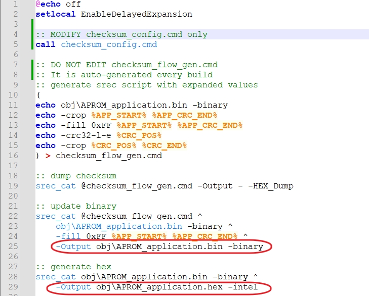

**generateChecksum.bat**

```c
@echo off
setlocal EnableDelayedExpansion

:: MODIFY checksum_config.cmd only
:: Load application layout configuration
:: Used only during batch execution
call checksum_config.cmd

:: DO NOT EDIT checksum_flow_gen.cmd
:: It is auto-generated every build
:: generate srec script with expanded values
:: Generate srec_cat script with expanded numeric values
:: Avoids %VAR% expansion issues in srec_cat
(
echo obj\APROM_application.bin -binary
echo -crop %APP_START% %APP_CRC_END%
echo -fill 0xFF %APP_START% %APP_CRC_END%
echo -crc32-l-e %CRC_POS%
echo -crop %CRC_POS% %CRC_END%
) > checksum_flow_gen.cmd

:: dump checksum
:: Execute checksum calculation
:: Output result as HEX dump to console
:: Used for verification
srec_cat @checksum_flow_gen.cmd -Output - -HEX_Dump

:: update binary
:: Write calculated checksum back into binary
:: Produces final binary with embedded CRC
srec_cat @checksum_flow_gen.cmd ^
    obj\APROM_application.bin -binary ^
    -fill 0xFF %APP_START% %APP_CRC_END% ^
    -Output obj\APROM_application.bin -binary

:: generate hex
:: Convert final binary into Intel HEX format
:: Used for programming or downstream tools
srec_cat obj\APROM_application.bin -binary ^
    -Output obj\APROM_application.hex -intel

```

**checksum_config.cmd** ==(the only file need to modify)==
```c
:: ===== Application layout configuration =====

:: application start
set APP_START=0x0000

:: checksum calculate end (exclude checksum field)
set APP_CRC_END=0x1DFFC

:: checksum field start
set CRC_POS=0x1DFFC

:: checksum field size (CRC32 = 4 bytes)
set CRC_SIZE=0x0004

:: checksum field end
set CRC_END=0x1E000

```


[back to top](#article_top)

---
